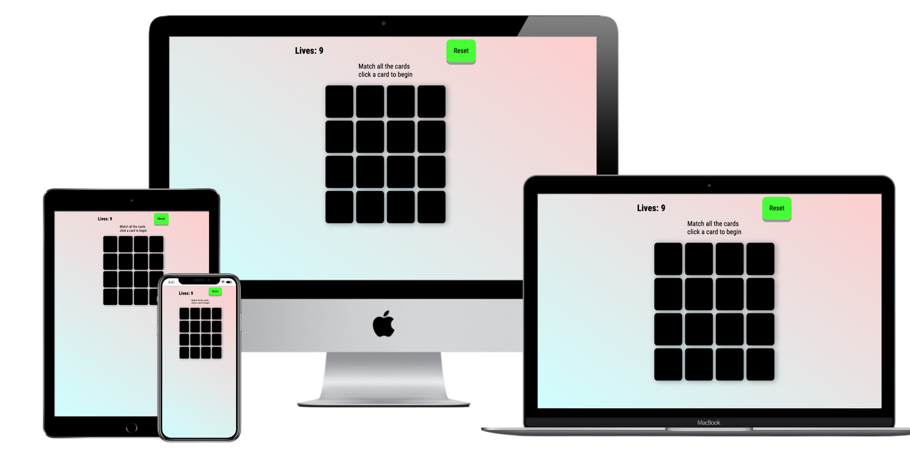
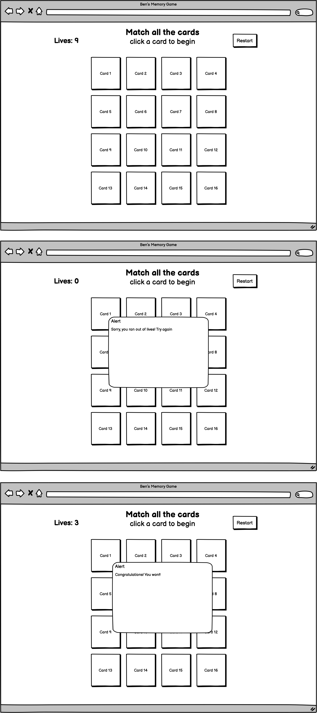
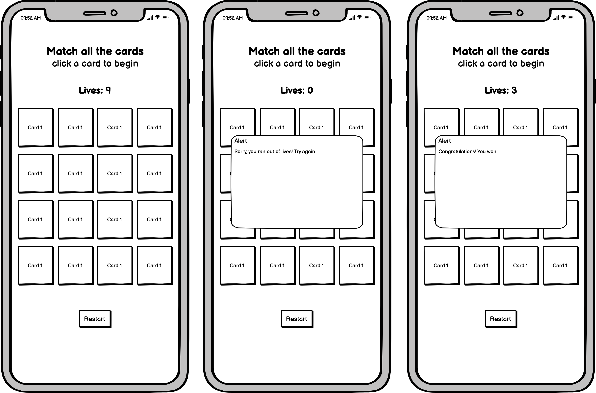
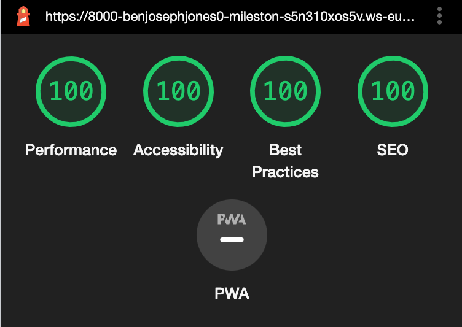

# Javascript Memory Game Website

View live project [here](#)

This is the website for a Javascript based memory game. It is designed to be responsive and accessible on a range of devices, making it easy to navigate for new players of the game, and entertaining for everyone once gameplay basics have been learned.

---
## User Experience (UX)

* ### User stories

    * __First time visitor goals__
        * (a) As a first time visitor I want to be able to know how to begin and playthrough the game with ease.
        * (b) As a first time visitor I want to be given feedback when I have completed an action or stage of the game.
        * (c) As a first time visitor I want to be able to continually know how well I am doing at the game, and then whether I have won or lost at the end of the game.

    * __Returning visitor goals__
        * (a) As a returning visitor I want to have a smooth gameplay experience, free from bugs and errors.

    * __Frequent user goals__
        * (a) As a frequent user I want for the game to be perceptibly different with each play.
        * (b) As a frequent user I want to be able to play the game on mobile devices so that I can play while on the go.

* ### Design

    * __Colour scheme__
        * The background color is an appealing, gradiated blue/pink, with clear, black font for the game description, and black as the color of the unflipped cards to provide most contrast with the colors of the flipped cards. The flipped cards are then paired by colour to indicate a match to the player. Once a match is found the two cards receive the '.matched' class and a corresponding inset box shadow to give the player a feeling that the match is 'set' and that the cards are no longer playable.

    * __Typography__
        * The main font used throughout the site is Roboto Condensed, with sans-serif used as a back up incase an error occurs with the google fonts CDN. Raleway was used for its simplicity, easy readibility, and general aesthetic compatilibility with the website. When a player either wins or loses the appropriate overlay is then displayed, on which the Press Start 2P font is used (with cursive as a back-up), which was chosen because of it's similarity with stereotypical, arcade game imagery.

    * __Imagery__
        * The grid of unflipped cards is the most eye catching feature when a user first logs on to the website. They are intentionally contrasted with the background in terms of colour, and have been given a box shadow to indicate 'distance' from the background and hint towards a player being able to flip them

    * __Layout__
        * The cards have been aligned in a simple 4 x 4 grid with player information and a reset button being situated directly above the grid.

    * __Progression from wireframes__
        * As can be seen below, the wireframes were adhered to quite rigidly, with the exception of the win/lose alert box being switched for an animated overlay, as it was decided that it looked better and provided the user with a clearer sense of congratulation/commiseration. Also, the relocation of the reset button for mobile screens was decided against due to issues of time and it not bringing marked user benefit.

* ### Wireframes

    * Desktop wireframe - 
    * Mobile wireframe - 

## Features

* Javascript based color matching game
* Reset button
* Automatic lives counter
* Automatic win/lose screen

## Technologies used

### Languages used

* HTML5
* CSS 3
* Javascript

### Frameworks, libraries and programmes used

1. [Google fonts](https://fonts.google.com/) was used for typography
2. [Git](https://www.gitpod.io/) was used for version control by utilizing the Gitpod terminal to commit to Git and Push to GitHub
3. [Github](https://github.com/) was used to store the code after being pushed from Gitpod
4. [Balsamiq](https://balsamiq.com/) was used to create the wireframes

## Testing

The W3C Markup Validator, W3C CSS Validator, and JShint services were used to validate every page of the project to ensure there were no syntax errors in the project.

* W3C HTML validator results - 
* W3C CSS validator results - 
* JShint results - 

### Testing User Stories from User Experience (UX) Section

* __First time visitor goals__
    * (a) As a first time visitor I want to be able to know how to begin and playthrough the game with ease.
        * When you first visit the website you are greeted by a descriptive passage teeling you to 'match all the cards' and 'click a card to begin'.
    * (b) As a first time visitor I want to be given feedback when I have completed an action or stage of the game.
        * When you click on a card it's color is revealed. When you click on a second card you are either presented with a match (that is visibility set with the inset box shadow mentioned previously), or a mis-match indicated by the automatic unflipping of the cards after a 500ms timeout.
    * (c) As a first time visitor I want to be able to continually know how well I am doing at the game, and then whether I have won or lost at the end of the game.
        * There is a prominent 'lives' counter in the top left corner of the game screen that decreases by 1 every time the user selects a mis-matched pair of cards. When the lives count reaches zero a losing overlay is presented with an appropriate message. If the user matches all the cards before their lives counter reaches zero they are presented with the corresponding win overlay.

    * __Returning visitor goals__
        * (a) As a returning visitor I want to have a smooth gameplay experience, free from bugs and errors.
            * Much effort was put into testing and bug removal. This process is documented in the 'Testing' section above and the 'Further Testing' section below.

    * __Frequent user goals__
        * (a) As a frequent user I want for the game to be perceptibly different with each play.
            * Using the shuffleCards function, the colors of the cards are shuffled with each page reload, and with each click of the reset button in the top right corner of the game.
        * (b) As a frequent user I want to be able to play the game on mobile devices so that I can play while on the go.
            * The game is fully responsive to different screen sizes and can be easily played on mobile devices. This has been tested thoroughly.

### Further testing

* Through Google Chrome Dev tools the website was viewed on a variety of devices such as Desktop, Laptop, iPhone7, iPhone 8 & iPhoneX.
* Friends and family were consulted and asked to use the website to further ensure of the websites strong functionality.
* Several bugs were found through these testing procedures - for example, when a card was double clicked the logic considered it a match as it technically had the same data-attribute. This was solved on line 77 of script.js. It was also discovered that the board had to be locked after 2 cards were selected so that no more cards can be selected, otherwise the game would glitch. This was resolved by setting a global 'pause' variable and using it throughout the logic e.g on line 75 of script.js. The final bug was that after 2 mismatched cards had been selected, the user was not able to re-select the first of the previous pair. This was countered by resetting the value of 'firstReveal' after each selected pair.
* The Lighthouse feature on Google's dev tools was used and the site was edited accordingly. For example, a meta description was added to the head of the page to improve SEO.

## Deployment

### The project was deployed to Github using the following method:

1. Login to Github and find the correct Github repository
2. At the top of the repository click 'Settings'
3. Scroll down the settings options until you get to the 'Github pages' section, click 'Check it out here!'
4. On the source dropdown menu, select 'main'
5. The page will automatically refresh, then click save.
6. Scroll back through the page to locate the now published site link in the "GitHub Pages" section

## Credits

### Code

* [This](https://github.com/Code-Institute-Solutions/SampleREADME#code-institute-website) Code Institute README.md template was consulted and tailored during the writing of this README.md file for the purposes of structure, typical README.md contents, and boiler plate materials.
* The shuffling function used within this project is tailored from Web Dev Junkie and can be found at this link (https://www.youtube.com/watch?v=bbb9dZotsOc).

### Content

* All content was written by the developer.

### Media

* No images or media was used that required acknowlegment or credit attribution.

### Acknowledgements

* Code Institute Tutor support for continuous practical tips and advice.